<!-- Auto-generated by scripts/generate_wiki.py — do not edit -->

# System Execution Map

How systems execute each tick in `SimulationPlugin::build()`.

## Execution Order

```mermaid
graph TD
    subgraph chain1_5["Chain 1.5: Items & Den Management"]
        items_prune_stored_items["items::prune_stored_items"]
        items_sync_food_stores["items::sync_food_stores"]
        items_prune_stored_items --> items_sync_food_stores
        prey_update_den_pressure["prey::update_den_pressure"]
        items_sync_food_stores --> prey_update_den_pressure
        prey_apply_den_raids["prey::apply_den_raids"]
        prey_update_den_pressure --> prey_apply_den_raids
        prey_orphan_prey_adopt_or_found["prey::orphan_prey_adopt_or_found"]
        prey_apply_den_raids --> prey_orphan_prey_adopt_or_found
    end
    subgraph chain2["Chain 2: Needs, Mood & Decision-Making"]
        needs_decay_needs["needs::decay_needs"]
        needs_decay_grooming["needs::decay_grooming"]
        needs_decay_needs --> needs_decay_grooming
        needs_eat_from_inventory["needs::eat_from_inventory"]
        needs_decay_grooming --> needs_eat_from_inventory
        needs_decay_exploration["needs::decay_exploration"]
        needs_eat_from_inventory --> needs_decay_exploration
        needs_bond_proximity_social["needs::bond_proximity_social"]
        needs_decay_exploration --> needs_bond_proximity_social
        pregnancy_tick_pregnancy["pregnancy::tick_pregnancy"]
        needs_bond_proximity_social --> pregnancy_tick_pregnancy
        growth_tick_kitten_growth["growth::tick_kitten_growth"]
        pregnancy_tick_pregnancy --> growth_tick_kitten_growth
        growth_kitten_mood_aura["growth::kitten_mood_aura"]
        growth_tick_kitten_growth --> growth_kitten_mood_aura
        mood_update_mood["mood::update_mood"]
        growth_kitten_mood_aura --> mood_update_mood
        mood_mood_contagion["mood::mood_contagion"]
        mood_update_mood --> mood_mood_contagion
        mood_bond_proximity_mood["mood::bond_proximity_mood"]
        mood_mood_contagion --> mood_bond_proximity_mood
        memory_decay_memories["memory::decay_memories"]
        mood_bond_proximity_mood --> memory_decay_memories
        coordination_evaluate_coordinators["coordination::evaluate_coordinators"]
        memory_decay_memories --> coordination_evaluate_coordinators
        coordination_assess_colony_needs["coordination::assess_colony_needs"]
        coordination_evaluate_coordinators --> coordination_assess_colony_needs
        coordination_dispatch_urgent_directives["coordination::dispatch_urgent_directives"]
        coordination_assess_colony_needs --> coordination_dispatch_urgent_directives
        coordination_accumulate_build_pressure["coordination::accumulate_build_pressure"]
        coordination_dispatch_urgent_directives --> coordination_accumulate_build_pressure
        coordination_spawn_construction_sites["coordination::spawn_construction_sites"]
        coordination_accumulate_build_pressure --> coordination_spawn_construction_sites
    end
    subgraph chain3["Chain 3: Action Resolution"]
        task_chains_resolve_task_chains["task_chains::resolve_task_chains"]
        magic_resolve_magic_task_chains["magic::resolve_magic_task_chains"]
        task_chains_resolve_task_chains --> magic_resolve_magic_task_chains
        magic_apply_remedy_effects["magic::apply_remedy_effects"]
        magic_resolve_magic_task_chains --> magic_apply_remedy_effects
        buildings_process_gates["buildings::process_gates"]
        magic_apply_remedy_effects --> buildings_process_gates
        buildings_tidy_buildings["buildings::tidy_buildings"]
        buildings_process_gates --> buildings_tidy_buildings
    end
    subgraph chain4["Chain 4: Social, Combat, Death & Narrative"]
        social_passive_familiarity["social::passive_familiarity"]
        personality_friction_personality_friction["personality_friction::personality_friction"]
        social_passive_familiarity --> personality_friction_personality_friction
        social_check_bonds["social::check_bonds"]
        personality_friction_personality_friction --> social_check_bonds
        colony_knowledge_update_colony_knowledge["colony_knowledge::update_colony_knowledge"]
        social_check_bonds --> colony_knowledge_update_colony_knowledge
        combat_resolve_combat["combat::resolve_combat"]
        colony_knowledge_update_colony_knowledge --> combat_resolve_combat
        combat_heal_injuries["combat::heal_injuries"]
        combat_resolve_combat --> combat_heal_injuries
        wildlife_fox_lifecycle_tick["wildlife::fox_lifecycle_tick"]
        combat_heal_injuries --> wildlife_fox_lifecycle_tick
        wildlife_fox_confrontation_tick["wildlife::fox_confrontation_tick"]
        wildlife_fox_lifecycle_tick --> wildlife_fox_confrontation_tick
        wildlife_fox_store_raid_tick["wildlife::fox_store_raid_tick"]
        wildlife_fox_confrontation_tick --> wildlife_fox_store_raid_tick
        magic_personal_corruption_effects["magic::personal_corruption_effects"]
        wildlife_fox_store_raid_tick --> magic_personal_corruption_effects
        death_check_death["death::check_death"]
        magic_personal_corruption_effects --> death_check_death
        coordination_flag_coordinator_death["coordination::flag_coordinator_death"]
        death_check_death --> coordination_flag_coordinator_death
        coordination_expire_directives["coordination::expire_directives"]
        coordination_flag_coordinator_death --> coordination_expire_directives
        death_cleanup_dead["death::cleanup_dead"]
        coordination_expire_directives --> death_cleanup_dead
        wildlife_cleanup_wildlife["wildlife::cleanup_wildlife"]
        death_cleanup_dead --> wildlife_cleanup_wildlife
        narrative_generate_narrative["narrative::generate_narrative"]
        wildlife_cleanup_wildlife --> narrative_generate_narrative
        goap_check_anxiety_interrupts["goap::check_anxiety_interrupts"]
        narrative_generate_narrative --> goap_check_anxiety_interrupts
        goap_evaluate_and_plan["goap::evaluate_and_plan"]
        goap_check_anxiety_interrupts --> goap_evaluate_and_plan
        goap_resolve_goap_plans["goap::resolve_goap_plans"]
        goap_evaluate_and_plan --> goap_resolve_goap_plans
        goap_emit_plan_narrative["goap::emit_plan_narrative"]
        goap_resolve_goap_plans --> goap_emit_plan_narrative
    end
    subgraph standalone["Standalone Systems"]
        magic_CorruptionPushback["magic::CorruptionPushback"]
        time_advance_time["time::advance_time"]
        weather_update_weather["weather::update_weather"]
        wind_update_wind["wind::update_wind"]
        time_emit_weather_transitions["time::emit_weather_transitions"]
        magic_corruption_spread["magic::corruption_spread"]
        magic_ward_decay["magic::ward_decay"]
        magic_herb_seasonal_check["magic::herb_seasonal_check"]
        magic_advance_herb_growth["magic::advance_herb_growth"]
        magic_advance_flavor_growth["magic::advance_flavor_growth"]
        magic_herb_regrowth["magic::herb_regrowth"]
        magic_corruption_tile_effects["magic::corruption_tile_effects"]
        magic_apply_corruption_pushback["magic::apply_corruption_pushback"]
        magic_spawn_shadow_fox_from_corruption["magic::spawn_shadow_fox_from_corruption"]
        wildlife_spawn_wildlife["wildlife::spawn_wildlife"]
        wildlife_wildlife_ai["wildlife::wildlife_ai"]
        wildlife_fox_movement["wildlife::fox_movement"]
        wildlife_fox_needs_tick["wildlife::fox_needs_tick"]
        fox_goap_sync_fox_needs["fox_goap::sync_fox_needs"]
        fox_goap_fox_evaluate_and_plan["fox_goap::fox_evaluate_and_plan"]
        fox_goap_fox_resolve_goap_plans["fox_goap::fox_resolve_goap_plans"]
        fox_goap_feed_cubs_at_dens["fox_goap::feed_cubs_at_dens"]
        fox_goap_resolve_paired_confrontations["fox_goap::resolve_paired_confrontations"]
        wildlife_fox_ai_decision["wildlife::fox_ai_decision"]
        wildlife_fox_scent_tick["wildlife::fox_scent_tick"]
        wildlife_predator_hunt_prey["wildlife::predator_hunt_prey"]
        wildlife_carcass_decay["wildlife::carcass_decay"]
        wildlife_predator_stalk_cats["wildlife::predator_stalk_cats"]
        prey_prey_population["prey::prey_population"]
        prey_prey_hunger["prey::prey_hunger"]
        prey_prey_ai["prey::prey_ai"]
        prey_prey_den_lifecycle["prey::prey_den_lifecycle"]
        wildlife_detect_threats["wildlife::detect_threats"]
        buildings_apply_building_effects["buildings::apply_building_effects"]
        buildings_decay_building_condition["buildings::decay_building_condition"]
        items_decay_items["items::decay_items"]
        disposition_cat_presence_tick["disposition::cat_presence_tick"]
        personality_events_emit_personality_events["personality_events::emit_personality_events"]
        ai_emit_periodic_events["ai::emit_periodic_events"]
        snapshot_emit_cat_snapshots["snapshot::emit_cat_snapshots"]
        snapshot_emit_position_traces["snapshot::emit_position_traces"]
        snapshot_emit_spatial_snapshots["snapshot::emit_spatial_snapshots"]
        colony_score_emit_colony_score["colony_score::emit_colony_score"]
        fate_assign_fated_connections["fate::assign_fated_connections"]
        fate_awaken_fated_connections["fate::awaken_fated_connections"]
        aspirations_select_aspirations["aspirations::select_aspirations"]
        aspirations_check_second_aspiration_slot["aspirations::check_second_aspiration_slot"]
        aspirations_check_aspiration_abandonment["aspirations::check_aspiration_abandonment"]
        aspirations_track_milestones["aspirations::track_milestones"]
    end

    %% Cross-chain data flows
    time_advance_time -.->|"TimeState"| weather_update_weather
    items_sync_food_stores -.->|"FoodStores"| needs_eat_from_inventory
    needs_decay_needs -.->|"Needs"| mood_update_mood
    mood_update_mood -.->|"Mood"| disposition_evaluate_dispositions
    disposition_evaluate_dispositions -.->|"Disposition"| disposition_disposition_to_chain
    disposition_disposition_to_chain -.->|"TaskChain"| task_chains_resolve_task_chains
    combat_resolve_combat -.->|"Health/Injury"| death_check_death
    social_passive_familiarity -.->|"Relationships"| social_check_bonds
    coordination_assess_colony_needs -.->|"ColonyPriority"| disposition_evaluate_dispositions
    prey_prey_population -.->|"prey entities"| wildlife_predator_hunt_prey
    death_check_death -.->|"Dead marker"| death_cleanup_dead
    magic_corruption_spread -.->|"TileMap corruption"| magic_spawn_shadow_fox_from_corruption
```

## Data Flow Summary

| From | To | Via |
|------|-----|-----|
| `time::advance_time` | `weather::update_weather` | TimeState |
| `items::sync_food_stores` | `needs::eat_from_inventory` | FoodStores |
| `needs::decay_needs` | `mood::update_mood` | Needs |
| `mood::update_mood` | `disposition::evaluate_dispositions` | Mood |
| `disposition::evaluate_dispositions` | `disposition::disposition_to_chain` | Disposition |
| `disposition::disposition_to_chain` | `task_chains::resolve_task_chains` | TaskChain |
| `combat::resolve_combat` | `death::check_death` | Health/Injury |
| `social::passive_familiarity` | `social::check_bonds` | Relationships |
| `coordination::assess_colony_needs` | `disposition::evaluate_dispositions` | ColonyPriority |
| `prey::prey_population` | `wildlife::predator_hunt_prey` | prey entities |
| `death::check_death` | `death::cleanup_dead` | Dead marker |
| `magic::corruption_spread` | `magic::spawn_shadow_fox_from_corruption` | TileMap corruption |
