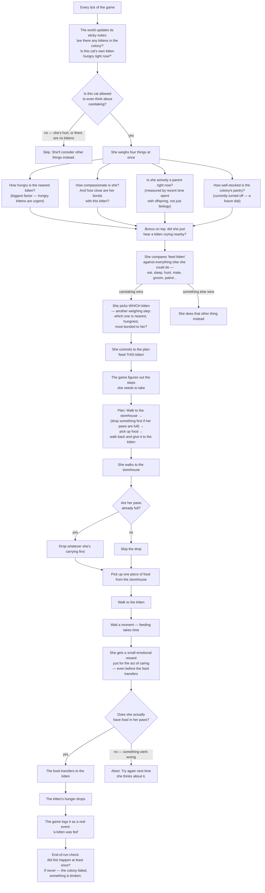

# How a mother feeds a kitten in Clowder

Nobody in the game tells the mother to feed her kitten. There's no
"feed kitten now" command anywhere in the code. Instead, every cat
re-thinks her own life from scratch many times per second, weighing
maybe a dozen things she could be doing, and *sometimes* the answer
that comes out is "go get food, walk to the kitten, give it to her."

This is what has to line up for that to happen — and the long list of
ways it used to go wrong.

## The flow, start to finish

## What's happening in plain words

The cat's "brain" runs in **layers**, and each layer has a job:

1. **What does she notice?** The game keeps sticky notes on the world —
   "there's a kitten over there," "she's hungry," "this cat is her
   mother." If the sticky notes are wrong or missing, nothing downstream
   works.

2. **Is she even allowed to consider this?** A cat who's injured can
   only eat, sleep, or rest. A cat in a colony with no kittens can't
   consider caretaking at all (otherwise she'd try to feed a kitten
   that doesn't exist).

3. **How much does she want to?** She weighs four things at once and
   adds them up. The kitten's hunger matters most. Her personal
   compassion and her bond with the kitten matter next. Whether she's
   actively been parenting recently matters too. (There's a fourth dial
   tied to how well-stocked the colony is, but it's turned off right
   now — saved for future balancing.)

4. **Did she just hear a cry?** If a kitten cried near her, that adds
   a small extra nudge toward caretaking on top of everything else.

5. **Is caretaking the winner?** She's also weighing eating, sleeping,
   hunting, mating, grooming herself, grooming a friend, patrolling,
   helping cook, gathering herbs, and more. They all get scored, and
   the highest score wins (with some randomness — she's a cat, not a
   spreadsheet).

6. **Which kitten?** If caretaking wins, she has to pick *one*. Closer
   is better. Hungrier is better. More-bonded is better. These get
   weighed the same way the bigger decision did.

7. **What are the actual steps?** The game figures out the sequence:
   walk to where the food is, possibly drop something to free up her
   paws, pick up a piece of food, walk to the kitten, give it to her.

8. **Does each step really happen?** Each step has to actually change
   the world — not just *say* it changed it. The food has to *really*
   move from the storehouse to her paws, then *really* move from her
   paws to the kitten. If any of those moves silently fails (paws
   already full, food disappeared, the kitten wandered off), the
   plan gets abandoned and she'll try again later.

9. **Did it leave a trace?** Successful feeding is logged. At the end
   of a long simulation we check: did any kitten get fed, at least
   once? If the answer is no, something is broken — that's a
   "the colony failed" signal.

## Why this took so much work

Each piece sounds straightforward. The problem is they all have to
agree, and any two of them can quietly disagree without anyone
noticing for a long time. Some real bugs from the project history:

- **The mother walked to the storehouse, mimed feeding the kitten,
  and walked away — except she never picked up any food.** The plan
  went "walk to storehouse, feed kitten" with no "pick up food" step
  in the middle. The feed step ran with empty paws and the game *said*
  it succeeded. Kittens were quietly starving while the logs looked
  fine. Took a while to spot because nothing was crashing.

- **The game tried to feed a kitten when no kittens existed.** Cats
  with high compassion would decide to caretake even in a colony
  with zero kittens, because compassion is part of their personality
  and doesn't depend on whether kittens are around. The game would
  then try to pick "which kitten?" and find nothing. Fixed by adding
  the upfront check: are there even any kittens here?

- **The new "drop something to free up your paws" step accidentally
  required her paws to already be empty.** So cats arriving at the
  storehouse holding herbs or a half-eaten mouse couldn't execute
  the plan at all. Zero feedings in a whole simulation.

- **Adding "did she hear a cry?" as a 5th factor accidentally
  weakened the other four.** When you weigh five things instead of
  four, each one gets a smaller share. Adding the cry factor made
  caretaking *less* likely overall, the opposite of what we wanted.
  Fix: don't add it as a competing factor — add it as a bonus on top.

- **The mother-bond strength was a yes/no flag (she IS the parent, or
  she ISN'T) when it needed to be a gradient.** Adoptive mothers,
  cats who'd been actively co-parenting, grandmothers — none of them
  registered as "parent" under the yes/no version. Replacing the
  flag with a continuous "how parental have you been lately?" score
  fixed it.

Every one of those bugs is now caught automatically — the game won't
even compile or start if certain things aren't wired up correctly.
But every one of those checks exists because the bug happened first.

## The short version

A mother feeding her kitten is the visible tip of:

- two sticky notes on the world,
- one "are you allowed to consider this?" check,
- four things she weighs at once,
- one bonus for hearing a cry,
- one big comparison against every other thing she could be doing,
- one more weighing step to pick which kitten,
- a four-step plan with two possible detours,
- two real-world actions (pick up food, give food),
- and one end-of-run check that the whole thing actually happened.

…all so that a cat with food in her paws can walk to a hungry kitten
and put it down.
